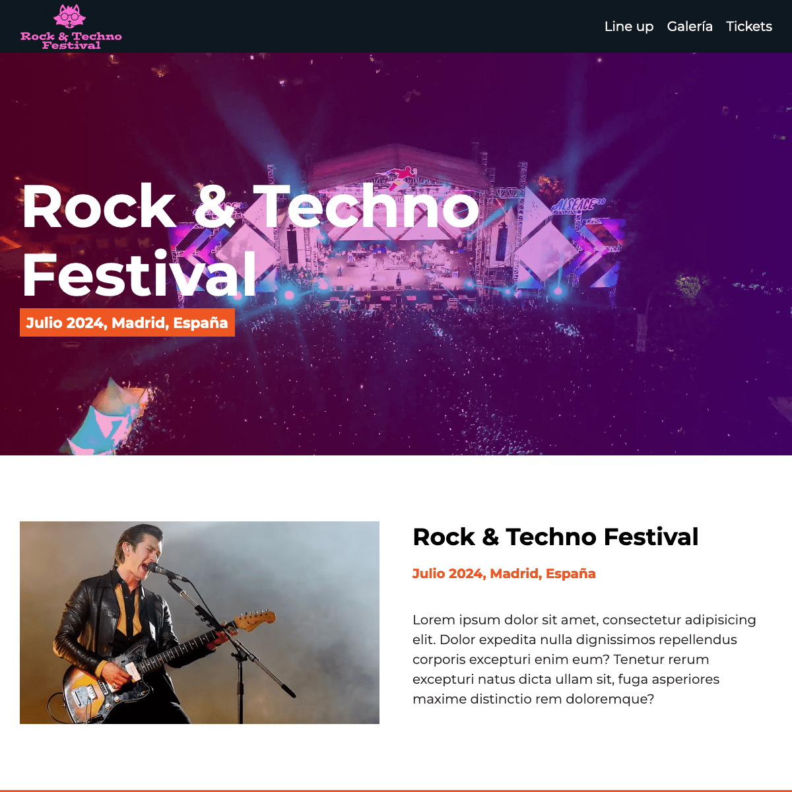

<h1 align="center">Proyecto Festival de Música</h1>

  

Este proyecto fue diseñado para consolidar mis habilidades en <strong>maquetación web</strong>, con el propósito de promover y
gestionar un festival de música. El objetivo principal es ofrecer una plataforma visualmente atractiva y funcional,
donde los usuarios puedan acceder a información detallada sobre los eventos, horarios y artistas, asegurando una
experiencia de usuario fluida y atractiva.

## Tecnologías Utilizadas

Para este proyecto, se han utilizado las siguientes tecnologías:

<table align="center">
  <tr align="center">
    <th><strong>Frontend</strong></th>
    <th><strong>Herramientas de Desarrollo</strong></th>
    <th><strong>Infraestructura</strong></th>
  </tr>
  <tr align="center">
    <td>
      
      
      
    </td>
    <td>
      
      
    </td>
    <td>
      
      
    </td>
  </tr>
</table>

Se utilizó <strong>Gulp</strong> como herramienta de automatización para optimizar imágenes y
conectar con <strong>Sass</strong> en la gestión de hojas de estilo. Esto permitió la minificación eficiente del
código y mejoró significativamente el rendimiento del sitio web.
            
Además, <strong>JavaScript</strong> se implementó para crear una galería de imágenes optimizadas y manejar las
interacciones dinámicas a través del <strong>DOM</strong>.
            
El despliegue del proyecto se gestionó mediante un <strong>pipeline de CI/CD</strong>, asegurando un proceso de desarrollo ágil y
eficiente. La integración continua con <strong>GitHub</strong> y el despliegue automatizado en <strong>Netlify</strong> 
garantizan actualizaciones rápidas y sin interrupciones, proporcionando un sitio web robusto y escalable.

## Contacto

Cristian Eduardo Castro Vargas  
[Email](cj.94@hotmail.com) | [LinkedIn](https://www.linkedin.com/in/cristian-castro-vargas/) | [Portafolio](https://cristian-castro.com/)
